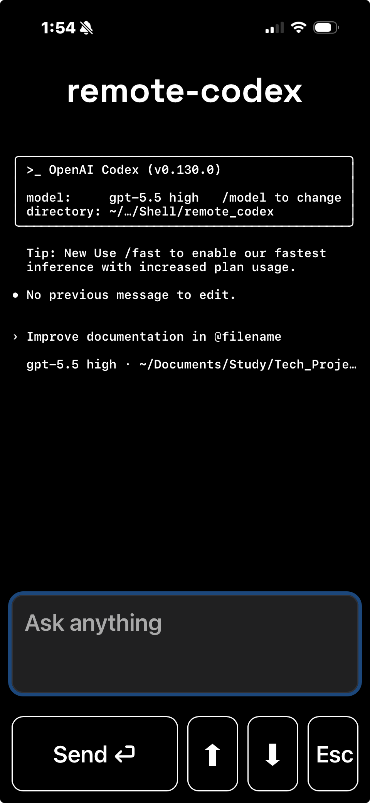

# Remote codex session 📡

Run a remote codex session from your IPhone. \
Uses `caffeinate -i` to keep connection alive (prevents Mac from sleeping while connected to power) 

## Screenshot 



## Requirements

- ChatGPT subscription and Codex CLI <https://developers.openai.com/codex/quickstart?setup=cli>
- Tailscale account with phone and computer connected to the same tailnet: <https://tailscale.com/>

## Instructions

1. Activate virtual environment:

```bash
python -m venv .venv
source .venv/bin/activate
```
 

2. Install dependencies:

```bash
pip install -r requirements.txt
```

3. In the project root run: 

```bash
zsh start.sh
```

This will launch 2 detached tmux sessions: 
- `codex`: session running codex 
- `server`: session running uvicorn, serving a small API and front-end UI on port 8000

4. Point your IPhone to web url: <http://your-mac-tailscale-name:8000>

That's it!

> [!TIP]

- To grab your computer's Tailscale address (MagicDNS), open the Tailscale app on your phone and click on your connected machine. 
- Attach a Mac terminal: `tmux attach -t SESSION_NAME`
- Kill specific session: `tmux kill-session -t SESSION_NAME`
- Kill all: `tmux kill-server`
- On IPhone click `Add to Home Screen` on the web url for easy access in a dedicated browser session
